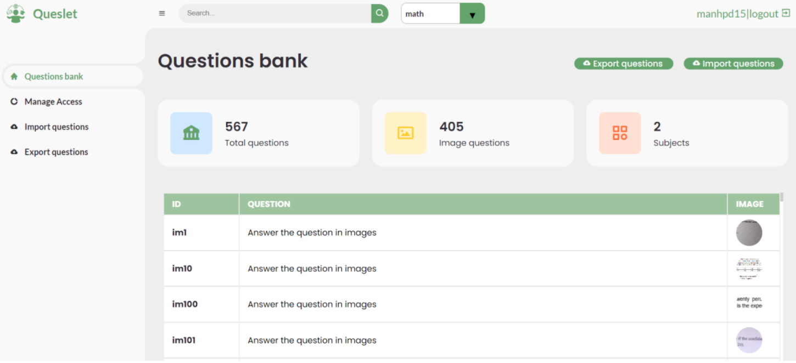
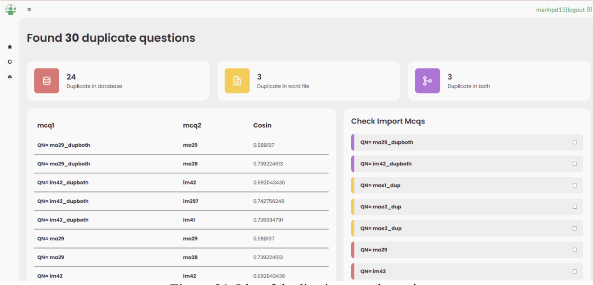

# Queslet-questionbank

The website is used to manage the question bank, support users to enter according to Case 2 of FPT University, the teacher can import the Directory (including word files and images) and the website will detect duplicate questions that already exist. in which the question bank. Using framework Django, Database(Picone, PostgreSQL)


## Framework

[](https://badge.fury.io/py/easyocr) [](https://github.com/JaidedAI/EasyOCR) [](https://colab.to/easyocr) 
[](https://huggingface.co/)

## Deployment

To deploy this project 

```bash
  npm run deploy
```


## Screenshots
**Homepage**



**Import Page**



